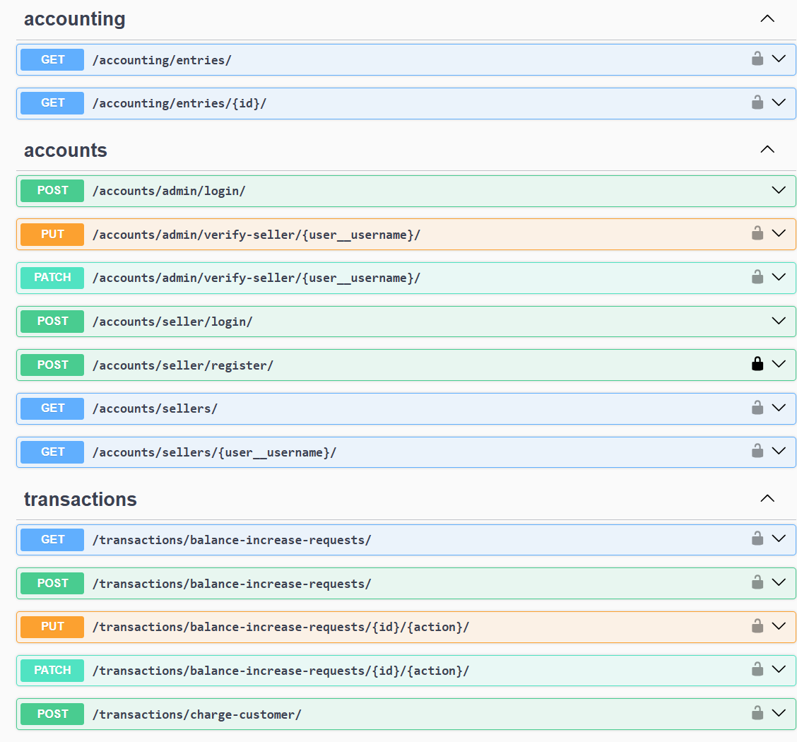

# B2B Balance Manager

B2B Balance Manager is a Django RESTful API project designed to handle balance transactions, recharge requests, and
account management for sellers. This project includes functionalities for both admin and seller accounts, allowing for
secure verification, balance adjustments, and customer transactions.

## Features

- **Admin and Seller User Roles**:
    - Admins can verify sellers, approve balance requests, and view account details.
    - Sellers can log in, initiate balance increase requests, and charge customers directly.

- **Transaction Management**:
    - Supports customer charges and seller balance recharges.
    - Tracks and records each transaction for accountability and balance reconciliation.

- **Concurrency Handling**:
    - Supports high concurrency using multi-threaded and multi-process execution for high-traffic performance testing.

## Table of Contents

1. [Installation](#installation)
2. [Usage](#usage)
3. [API Endpoints](#api-endpoints)
4. [Testing and Performance](#testing-and-performance)

## Installation

1. **Clone the Repository and cd into the cloned directory**

2. **Create a virtual environment:**
    ```bash
    python3 -m venv venv
    source venv/bin/activate
    ```

3. **Install dependencies:**
    ```bash
    pip install -r requirements.txt
    ```

4. **Configuration (development):**
   Set up environment variables in a `.env` file in the root directory of your project. For example:

```
DATABASE_HOST=127.0.0.1
DATABASE_NAME=mydatabase
DATABASE_PASSWORD=mypassword
DATABASE_PORT=5432
DATABASE_USER=myuser
REDIS_ADDR=127.0.0.1
```

For production, although settings such as DATABASE_HOST and REDIS_ADDR are hard-coded in `docker-compose`,
they can be easily configured by using `--env-file <.env file path>` when running the docker compose up command.

## Usage
There are different docker compose files for production and development in root directory of the project to run the
server easily. For example to run and shut down the server in the production use the following commands:

**Running the server:**

```bash
docker compose -f docker-compose.yaml -f docker-compose.prod.yaml up
```

**Shutting down the server:**

```bash
docker compose -f docker-compose.yaml -f docker-compose.prod.yaml down
```

**Admin login:**
Admin users can access the Django admin interface for account verification:

```
http://127.0.0.1:8000/admin/
```

**API Authentication**
This project uses JWT for authentication. To access most endpoints, obtain a token through the login endpoints
(different end-points for admin and seller), then include it as a Bearer token in request headers.

```
Authorization: Bearer <token>
```

## API Endpoints

You can open http://localhost:8000/swagger/ for documentation and playing with APIs:


## Testing and Performance

1. **Run unit tests:**

```
python manage.py test apps
```

2. **Run load test**:

python3 functional_tests/performance/test_load_transactions.py --sellers 2 --num-requests 1000

```
- `--sellers`: Number of sellers.
- `--num-requests`: Total number of customer charge requests.
- `--executor`: Use ProcessPoolExecutor or ThreadPoolExecutor for concurrency.
- `--workers`: Number of workers to use.

```bash
docker compose -f docker-compose.yaml -f docker-compose.prod.yaml down
```

sample output:

```

************************* All tasks completed. Final balances: ********************************
seller2
  - initial_balance=456561.0
  - total_balance_increase=28797
  - charges_sold=12727
  - expected_balance= initial_balance + total_balance_increase - charges_sold=472631.0
  - actual_balance=472631.0
seller1
  - initial_balance=373876.0
  - total_balance_increase=14113
  - charges_sold=12852
  - expected_balance= initial_balance + total_balance_increase - charges_sold=375137.0
  - actual_balance=375137.0

***********************************************************************************************
```

